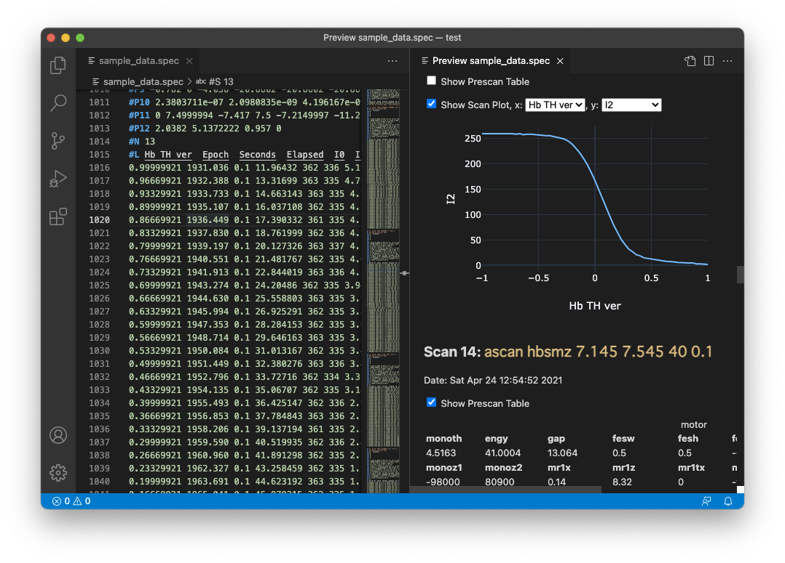

# __spec__ Data File Extension for Visual Studio Code

The extension enables a user to browse spreadsheet-like data in a graph with Visual Studio Code.
The graph feature can be controlled in a similar way with a built-in Markdown Preview feature.
For example, _spec data:Open Preview_ command (Win/Linux: `Ctrl+Shift+V`, Mac: `Cmd+Shift+V`) is available when a supported file is open.

The data file formats the exension supports are as follows:

- __CSV file__ (ID: `csv-column`, `csv-row`): CSV (character-separated values) files.
  - A pair of columns in a `csv-column` file and that of rows in a `csv-row` file can be graphically plotted.
  - All cells must be numeric; string may appear only in a header line that starts with a hash character (`#`).
  - A delimiter may be either a whitespace, tab, or comma, and is auto-detected.
  - The extension does not associate the file extensions such as `.csv`, `tsv`, or `dat` with and language ID by the following reasons:
    - The extension can not determine from the file extension which direction (column-wise or row-wise) an array should be extracted from a table.
    - The extension do not intend to support all possible features for general CSV files. The main feature is drawing a graph and thus files consisting of number only are targeted.
  - A data file exported by ESRF's __spec__ macro, [BLISS / mca.mac](https://www.esrf.fr/blissdb/macros/macdoc.py?macname=mca.mac), is also covered in `csv-row`.
- __spec standard data file__ (ID: `spec-data`, extension: `.spec`): files the __spec__ software outputs during various scan commands.
  - Note that the __spec__ software does not specify a file extension for the data format. Use of `.spec` for __spec__ data file is just the preference of the extension author.
- __fit2d chiplot file format__ (ID: `chiplot`, extension: `.chi`): a text file format in which __fit2d__ software imports and exports one-dimensional dataset such as scattering profiles.
- __DppMCA spectra data file format__ (ID: `dppmca`, extension: `.mca`): DppMCA is DP5 Digital Pulse Prosessor Display & Acquisition Software for Multichannel Analyzers, developed by Amptek.

While the default file associations (relations between language identifier and file extensions) are set as listed above, a user can customize them using `files.associations` setting.
Read [Language Support in Visual Studio Code](https://code.visualstudio.com/docs/languages/overview) (official document of VS Code) for further details.

## What's __spec__?

> __spec__ is internationally recognized as the leading software for instrument control and data acquisition in X-ray diffraction experiments.
> It is used at more than 200 synchrotrons, industrial laboratories, universities and research facilities around the globe.

_cited from [CSS - Certified Scientific Software](https://www.certif.com) homepage._

Note that the extension is not the official one developed by Certified Scientific Software.
Use [GitHub Issues](https://github.com/fujidana/vscode-spec-data/issues) for bug reports and feature requests about the extension.

## Features

- __Syntax highlighting__
- __Code navigation__ (`spec-data` and `dppmca` only)
  - __Listing symbols in the active editor__: the list shown in the _outline_ view in the _Explorer_ viewlet and breadcrumbs at the top of the editor view
- __Code folding__ (`spec-data` and `dppmca` only)
- __Preview__
  - motor positions just before a scan in a table view (`spec-data` only)
  - scan data depicted in a graphical and interactive graph, powered by [Plotly.js](https://plotly.com/javascript/). A user can select a pair of columns to be drawn.
  - scroll sync of the editor and preview (as of v.1.7.0 both _scroll-preview-with-editor_ and _scroll-editor-with-preview_ are supported.)



## Requirements

Nothing.

## Extension Settings

This extension contributes configuration options, accecible from the _Settings_ editor (Win/Linux: `Ctrl+,`, Mac: `Cmd+,`).
Read [Visual Studio Code User and Workspace Settings](https://code.visualstudio.com/docs/getstarted/settings) for details about the _Settings_ window.

### Customization of Graph Appearances

__note__: `spec-data.preview.plot.traceTemplate` was deprecated and the way to customize the templates was changed at v1.7.0.
Read the following to migrate the settings.

To the extension author's knowledge, Plotly.js does not provide a simple way to support so-called dark mode.
Therefore, the extension has prepared its own Plotly.js templates for the four color themes of VS Code and switches them according to the active color theme of VS Code.
These template objects can be found at [src/previewTemplates.ts](https://github.com/fujidana/vscode-spec-data/blob/master/src/previewTemplates.ts) in the GitHub repository.

A user can modify the appearance of graphs by overriding these templates via the `spec-data.preview.plot.traceTemplate` and `spec-data.preview.plot.layoutTemplate` settings.
Both the settings shall be a JSON object having at most 4 keys, `"light"`, `"dark"`, `"highContrast"`, and `"highContrastLight"`. The template shall be defined with respect to each color theme.

The former setting, `spec-data.preview.plot.traceTemplate`, is for customization of trace appearances such as a line color.
The value corresponding to each color theme shall be an array of template objects for scatter plots.
The templates are applied cyclically to multiple traces.
With the following example, the extension draws traces in red and blue altenatively only when _light_ color theme is selected.

```json
{
  "spec-data.preview.plot.traceTemplate": {
    "light": [
        { "marker": { "color": "#f00" }, "line": { "color": "#f00" } },
        { "marker": { "color": "#00f" }, "line": { "color": "#00f" } }
    ]
  }
}
```

One can find parameter names typically used for customization in the extension's default template file, [src/previewTemplates.ts](https://github.com/fujidana/vscode-spec-data/blob/master/src/previewTemplates.ts).
For more comprehensive list of trace template parameters, see [Plotly.com - Scatter traces in JavaScript](https://plotly.com/javascript/reference/scatter/).

The latter setting, `spec-data.preview.plot.layoutTemplate`, is for customization of layout appearances such as a background color.
Unlike the former setting, the value for the color theme key in this setting is an object (IOW, dictionary), not an array.
One can find parameter names typically used for customization in the extension's template file, [src/previewTemplates.ts](https://github.com/fujidana/vscode-spec-data/blob/master/src/previewTemplates.ts).
For more comprehensive list of layout template parameters, see [Plotly.com - Layout in JavaScript](https://plotly.com/javascript/reference/layout/).

When an empty array and object are passed for these settings, they overwrite the extension's settings and thus, graphs are drawn with vanilla Plotly.js's (i.e., not the extension's) template.
For example, with the following settings the graph is drawn in the default manner of Plotly.js, with white background color even in dark mode.

```json
{
    "spec-data.preview.plot.traceTemplate": { "dark": [] },
    "spec-data.preview.plot.layoutTemplate": { "dark": {} }
}
```

## Known Issues

See [GitHub Issues](https://github.com/fujidana/vscode-spec-data/issues) for a list of known issues.

## Release Notes

See [CHANGELOG.md](CHANGELOG.md).

## Contributing

The extension is open to contributions. Create an issue in [GitHub Issues](https://github.com/fujidana/vscode-spec-data/issues) for a bug report or a feature request.
If you want to contribute code, please read [CONTRIBUTING.md](CONTRIBUTING.md).

## Acknowledgements

- [Plotly.js](https://plotly.com/javascript/): Thanks for providing a powerful graphing library.

## Tips

### File associations using the file contents

In addition to a file extension, VS Code refers to the first line of a file in order to associate the file with a language (IOW, editor mode).
A text file starting with `# mode: csv-row` and `# mode: csv-column` is automatically associated with `csv-row` and `csv-column`, respectively.

### Make __spec__ output a row-wise CSV file

The following code is an example to output the data of an MCA device in __spec__.
This assumes an MCA device that has 1024 data points of 32-bit unsigned integer (`ulong`) type is configured at #0 slot in __spec__.

```
# create a buffer
ulong array buffer[1024]

# copy MCA data to the buffer
mca_sget(0, buffer)

# output data in a row.
array_op("row_wise", buffer, 1)
array_dump("output.csv", buffer)
```

Each time `array_dump()` is executed, a new line consisting of 1024 integers is appended at the end of file.

### Make __spec__ automatically set the file extension

_SPECD/standard.mac_ defines `user_filecheck(s)` funciton, which simply returns the input argument `s`.
A User can override this function in order to insert a macro to massage or test the file name for `newfile`.

To let `newfile` add `".spec"` as the file extension, define the following function in __spec__.

```
def user_filecheck(s) '{
    if (s == "null" || s == "/dev/null") {
        return s
    } else if (match(s, "^(.+/)?([^./]+)\$")) {
        # add ".spec" to filename if a user does not specify the file extension
        return sprintf("%s.spec", s)
    } else {
        # simply return the provided filename if a user specifies the file extension
        return s
    }
}'
```
