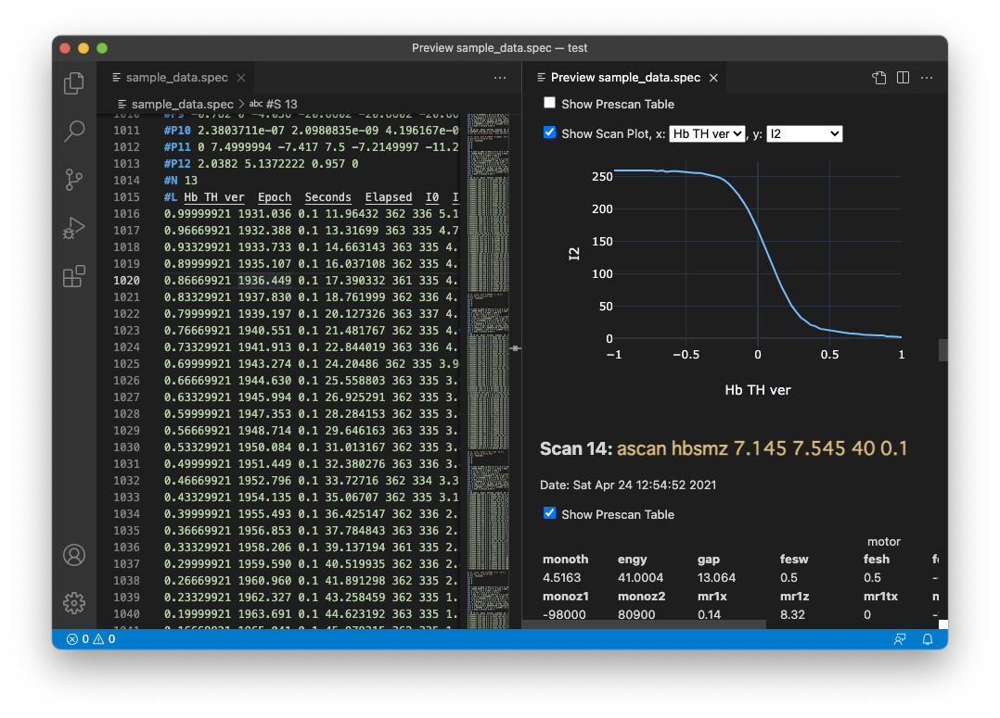

# __spec__ Data File and CSV Extension for Visual Studio Code

__NOTE__: As of v2.2.0, `spec-data.preview.plot.traceTemplate` and `spec-data.preview.plot.layoutTemplate` settings are deprecated.
See the [Extension Settings](#extension-settings) section in this document for details.

With this extension, users can browse spreadsheet-like data as a line plot, heatmap, or contour plot in the editor panes of Visual Studio Code (VS Code).
Supported file formats are CSV, __spec__ standard data file format and some others.
See the [Supported file formats](#supported-file-formats) section for details.

The graph feature can be controlled in a similar way to VS Code's built-in Markdown preview.
For example, _Reopen as Preview/Text_ command (Win/Linux: `Ctrl+Shift+V`, Mac: `Cmd+Shift+V`) is available when a supported file is open.



## Supported File Formats

The data file formats the exension supports are as follows:

- __CSV file__ (ID: `csv-column`, `csv-row`): CSV (character-separated values) files.
  - A pair of columns in a `csv-column` file and that of rows in a `csv-row` file can be graphically plotted.
  - All cells must be numeric; string may appear only in a header line that starts with a hash character (`#`).
  - _Fixed-width format_ (contiguous whitespaces as a delimiter) and _single-character-delimited format_ (single whitespace, tab, or comma as a delimiter) are supported. They are automatically detected by the file content.
  - The extension does not associate file extensions such as `.csv`, `.tsv`, or `.dat` with the language IDs for the following reasons:
    - The extension can not determine from the file extension which direction (column-wise or row-wise) an array should be extracted from a table.
    - The extension does not support all possible formats of CSV files. The extension focuses on drawing a graph and thus files consisting of only numberic values are supported.
  - A data file exported by ESRF's __spec__ macro, [BLISS / mca.mac](https://www.esrf.fr/blissdb/macros/macdoc.py?macname=mca.mac), is also covered in `csv-row`.
- __spec standard data file__ (ID: `spec-data`, extension: `.spec`): a text file the __spec__ software outputs during various scan commands.
  - Note that the __spec__ software does not specify a file extension for the data format. Use of `.spec` for __spec__ data file is just the preference of the extension author.
- __fit2d chiplot file format__ (ID: `chiplot`, extension: `.chi`): a text file format in which __fit2d__ software imports and exports one-dimensional dataset such as scattering profiles.
- __DppMCA spectra data file format__ (ID: `dppmca`, extension: `.mca`): a text file exported by Amptek's DppMCA.exe (DP5 Digital Pulse Prosessor Display & Acquisition Software for Multichannel Analyzers).

While the default file associations (relations between language identifier and file extensions) are set as listed above, a user can customize them using `files.associations` setting.
Read [Language Support in Visual Studio Code](https://code.visualstudio.com/docs/languages/overview) (official document of VS Code) for further details.

The _Custom Editor_ the extension provides for previewing the files is currently configured as _optional_.
This means that VS Code opens a file the extension supports with VS Code's built-in text editor and a user needs to switch the editor by calling the _Reopen With Editor_ command (or selecting the equivalent button/menu item) to preview data graphically.
A user can change the precedence of the editors via `workbench.editorAssociations` setting.

The following example settings let VS Code open files whose filename end with `_mca.dat` and `.spec` with the extension's preview editor. Note that `*.spec` is by default associated with `spec-data` and thus setting it in `files.associations` is unnecessary.

```json
// settings.json
{
    "files.associations": {
        "*_mca.dat": "csv-column",
    },
    "workbench.editorAssociations": {
        "*_mca.dat": "spec-data.preview.editor",
        "*.spec": "spec-data.preview.editor"
    }
}
```

## What's __spec__?

> __spec__ is internationally recognized as the leading software for instrument control and data acquisition in X-ray diffraction experiments.
> It is used at more than 200 synchrotrons, industrial laboratories, universities and research facilities around the globe.

_cited from [CSS - Certified Scientific Software](https://www.certif.com) homepage._

Note that the extension is not the official one developed by Certified Scientific Software.
Use [GitHub Issues](https://github.com/fujidana/vscode-spec-data/issues) for bug reports and feature requests about the extension.

## Features

- __Syntax highlighting__
- __Diagnostics__: show parsing errors and warnings in the _Problems_ view.
- __Code navigation__ (`spec-data` and `dppmca` only)
  - __Listing symbols in the active editor__: the list shown in the _outline_ view in the _Explorer_ view and breadcrumbs at the top of the editor view
- __Code folding__ (`spec-data` and `dppmca` only)
- __Preview__
  - motor positions just before a scan in a table view (`spec-data` only)
  - data shown in a line plot, heatmap, or contour plot. This feature is powered by [Plotly.js](https://plotly.com/javascript/).
  - scroll sync between an editor and a preview
  - Preview can be shown both in a regular __Webview Panel__ and in a __Custom Editor__ (editor ID: `spec-data.preview.editor`).

## Requirements

Nothing.

## Extension Settings

This extension contributes configuration options, accecible from the _Settings_ editor (Win/Linux: `Ctrl+,`, Mac: `Cmd+,`).
Read [Visual Studio Code User and Workspace Settings](https://code.visualstudio.com/docs/getstarted/settings) for details about the _Settings_ window.

### File Associations

See the [Supported File Formats](#supported-file-formats) section for details.

### Customization of Graph Appearances

The extension switches the apparances of graphs according to the active color theme of VS Code.
A user can customize them by providing JSON objects for the following _Settings_ points:

- `spec-data.preview.plot.template.data`: for control of the appearance related to data such as a line color.
- `spec-data.preview.plot.template.layout`: for control of the appearance related to layout elements such as a background color.

JSON objects for the settings can have the name of a color theme (`light`, `dark`, `highContrast`, or `highContrastLight`) as their key.
The value for the key that matches the current color theme is applied to the graph.

The values for the respective color theme keys are _data template_ objects for the `spec-data.preview.plot.template.data` setting and _layout template_ objects for the `spec-data.preview.plot.template.layout` setting.
The _data template_ and _layout template_ denoted here are objects that can be set as `data` and `layout` properties, respectively, of the Plotly.js `Template` object.
The _data template_ has a plot type (`scatter`, `heatmap`, or `contour`) as its key and an array as its value.
The objects in the array have properties that control the appearance of the data and they are applied cyclically if there are multiple traces in a graph.
The _layout template_ is an object that directly has properties that control the appearance of the layout.

The built-in templates are defined in [src/main/template.ts](src/main/template.ts).
They have the same structure as the JSON objects for the settings.
Reading this file will help a user understand how to write the setting.
The comprehensive list of the parameters can be found in Plotly.js's [Figure Reference](https://plotly.com/javascript/reference/index) page, especially for [scatter Traces](https://plotly.com/javascript/reference/scatter), [heatmap Traces](https://plotly.com/javascript/reference/heatmap), [contour Traces](https://plotly.com/javascript/reference/contour) and [Layout](https://plotly.com/javascript/reference/layout).

Shorthand such as `"marker.color"` is not available as a key of the object.

Color can be defined in various ways: it seems the color format Plotly.js
accepts as the template properties is the same as that of CSS.

As of v2.2.0, the built-in templates are shallow-merged (not overwritten) with the user-defined templates on the level of the objects for color theme keys.
As the result, passing `null` or `[]` to a property of the object in the user settings clears the corresponding built-in property and thus the appearance for that is reverted to Plotly'js's vanilla one.
The following example settings clear the built-in data templates for `scatter` plots and `plot_bgcolor` layout property in the `dark` theme, while keeping the built-in data templates for the other plot types (if it exists) and the other layout properties in the `dark` theme and all the built-in data templates and the layout properties for the other themes.

```json
// settings.json
{
    "spec-data.preview.plot.template.data": {
        "dark": {
            "scatter": []
        }
    },
    "spec-data.preview.plot.template.layout": {
        "dark": {
            "plot_bgcolor": null
        }
    }
}
```

## Known Issues

See [GitHub Issues](https://github.com/fujidana/vscode-spec-data/issues) for a list of known issues.

## Release Notes

See [CHANGELOG.md](CHANGELOG.md).

## Contributing

The extension is open to contributions. Create an issue in [GitHub Issues](https://github.com/fujidana/vscode-spec-data/issues) for a bug report or a feature request.
If you want to contribute code, please read [CONTRIBUTING.md](CONTRIBUTING.md).

## Acknowledgements

The extension relies on various npm packages, including [Plotly.js](https://plotly.com/javascript/).
Thanks to the authors of these packages.

## Tips

### File associations using the file contents

In addition to a file extension, VS Code refers to the first line of a file to determine the file association.
A text file starting with `# mode: csv-row` and `# mode: csv-column` is automatically associated with `csv-row` and `csv-column`, respectively.

### Make __spec__ output a row-wise CSV file

The following code is an example to output the data of an MCA device in __spec__.
This assumes an MCA device that has 1024 data points of 32-bit unsigned integer (`ulong`) type is configured at #0 slot in __spec__.

```
# create a buffer
ulong array buffer[1024]

# copy MCA data to the buffer
mca_sget(0, buffer)

# output data in a row.
array_op("row_wise", buffer, 1)
array_dump("output.csv", buffer)
```

Each time `array_dump()` is executed, a new line consisting of 1024 integers is appended at the end of file.

### Make __spec__ automatically set the file extension

_SPECD/standard.mac_ defines `user_filecheck(s)` funciton, which by default simply returns the input argument `s`.
A User can override this function in order to insert a macro to massage or test the file name for `newfile`.

To make `newfile` standard macro add `".spec"` as the file extension, define the following function in __spec__.

```
def user_filecheck(s) '{
    if (s == "null" || s == "/dev/null") {
        return s
    } else if (match(s, "^(.+/)?([^./]+)\$")) {
        # add ".spec" to filename if a user does not specify the file extension
        return sprintf("%s.spec", s)
    } else {
        # simply return the provided filename if a user specifies the file extension
        return s
    }
}'
```
